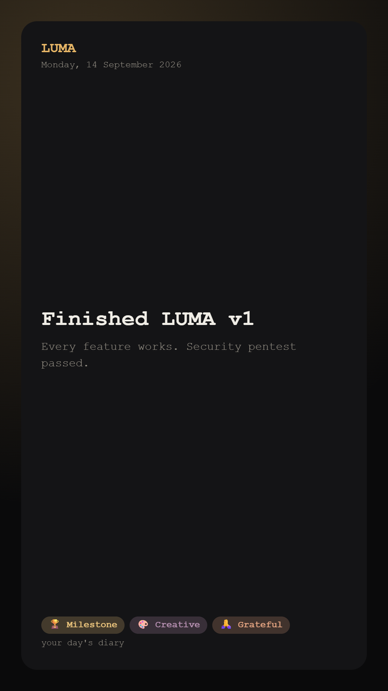

<div align="center">

# 🗒️ LUMA — *your day's diary*

A warm, dark, tactile journaling & productivity space. Write your day, drop the
photos from your phone, capture the moments that mattered, track your money —
and look back across the week, the month, and the whole year.

Built with **Next.js 16**, **Supabase**, **Resend**, and deployed on **Vercel**.



<sub>↑ a moment exported as a shareable card (one of four Instagram sizes)</sub>

</div>

---

## ✨ What it does

LUMA is a single, cohesive daily-journal app. Everything is organised around a
**day**, and every day rolls up into weekly, monthly and yearly views.

### The daily journal (`/app`)
- **📖 Journal editor** — a native, **dictation-friendly** textarea (works with
  Wispr Flow / OS voice typing) with **debounced autosave** and a one-tap **mood**.
- **📸 Photo Wall** — add photos straight from your phone. Images are
  **compressed client-side** (WebP, ≤1600px, <0.5 MB) before upload to a
  **private** per-user storage folder, each with an optional caption.
- **⭐ Key Moments** — capture what mattered with a **fixed set of colourful
  tags**; add, edit, delete, and **search** across everything later.
- **✅ To-Do** — a lightweight daily checklist with optimistic add/toggle/delete.
- **💸 Money** — today's spent / received totals, feeding the finance screens.
- **🎛️ Drag-to-rearrange** — every card is sortable; your layout is remembered
  per device.
- **🔥 Streak**, **✍️ prompt of the day**, and **🕰️ "on this day"** memories from
  past years all surface on the Today screen.

### Time views
- **🗓️ Weekly** (`/app/week`) — seven day-cards with mood, journaled status,
  moment/photo counts and net money.
- **📅 Monthly** (`/app/month`) — a calendar grid; each day shows its mood and
  gets brighter with more activity. Tap any day to open it.
- **🔥 Yearly** (`/app/year`) — a GitHub-style contribution **heatmap** plus
  current-streak and days-journaled stats.
- **📆 Any day** (`/app/day/[date]`) — open and edit any past day.

### Money & insight
- **💸 Financial tracker** (`/app/finance`) — log spent/received in **any
  currency**, by category, with a monthly net summary and a spend breakdown.
- **📊 Analytics** (`/app/analytics`) — an animated spend-by-category **donut**,
  in-vs-out bars, a **mood distribution**, top **moment tags**, and per-category
  **budgets** with live progress.

### Everyday niceties
- **🔒 Day lock** — an optional PIN that opens the app once per day, then
  re-locks (device-local privacy layer on top of real auth).
- **↗️ Shareable cards** — export any Key Moment as a branded image in **four
  Instagram formats** (Story 9:16, Portrait 4:5, Post 1:1, Landscape 1.91:1),
  rendered entirely client-side, shared via the native share sheet or downloaded.
- **📦 Data export** — download **all** your data as JSON (`/api/export`).
- **✉️ Email reminders** — gentle **daily** and **weekly** nudges, sent only on
  days you *don't* open LUMA.
- **👤 Profile & settings** — name, timezone, default currency, reminder
  opt-outs, the day lock, and export.
- **Custom 404s**, **robots.txt** + **sitemap.xml**, PWA **manifest**, dark theme
  throughout, and a fully **responsive**, mobile-first layout.

---

## 🎨 Design

Dark, mostly-black canvas with tactile **clay** surfaces (soft real shadows, not
frosted glass), a warm **gold glow** signature, and a **typewriter** type system
(Space Mono for display, Courier Prime for body). Colour is used sparingly —
marker highlights, accent-tinted cards — never loud. The landing page uses
scroll-reveal animations inspired by editorial product sites.

---

## 🧱 Tech stack

| Area | Choice |
| --- | --- |
| Framework | **Next.js 16** (App Router, React 19, Turbopack, TypeScript strict) |
| Styling | **Tailwind CSS v4** (CSS-first tokens) + a small clay design system |
| Backend | **Supabase** — Postgres, Auth, Storage, Row-Level Security |
| Auth/session | `@supabase/ssr` cookie sessions; route protection via Next 16 **`proxy.ts`** |
| Email | **Resend** (transactional) |
| Scheduling | **Vercel Cron** → `/api/cron/reminders` (daily) |
| Motion | **Framer Motion** |
| Drag & drop | **dnd-kit** |
| Images | **browser-image-compression** (client-side) |
| Validation | **Zod** on every server action |
| Hosting | **Vercel** |

---

## 🚀 Getting started

### Prerequisites
- **Node.js 20.9+**
- A **Supabase** project ([supabase.com](https://supabase.com))
- A **Resend** account for emails ([resend.com](https://resend.com)) — optional for local dev

### 1. Install
```bash
npm install
```

### 2. Configure environment
Copy the example and fill in your keys:
```bash
cp .env.example .env.local
```

| Variable | Description |
| --- | --- |
| `NEXT_PUBLIC_SUPABASE_URL` | Your Supabase project URL |
| `NEXT_PUBLIC_SUPABASE_PUBLISHABLE_KEY` | Supabase **publishable** key (`sb_publishable_…`) — browser-safe |
| `SUPABASE_SECRET_KEY` | Supabase **secret** key (`sb_secret_…`) — server-only; used by the reminder cron |
| `RESEND_API_KEY` | Resend API key (email reminders) |
| `RESEND_FROM_EMAIL` | Verified sender, e.g. `LUMA <hello@yourdomain.com>` |
| `NEXT_PUBLIC_SITE_URL` | Public base URL (used in reminder links + sitemap) |
| `CRON_SECRET` | Random string protecting the cron endpoint |

> LUMA uses Supabase's **new API key format** (`sb_publishable_…` / `sb_secret_…`).

### 3. Create the database
In the Supabase dashboard → **SQL Editor**, run the migration:
```
supabase/migrations/0001_init.sql
```
This creates every table with **owner-only RLS**, a private `photos` storage
bucket, a profile-on-signup trigger, and a seeded pool of daily prompts.

### 4. Run it
```bash
npm run dev      # http://localhost:3000
```

### Build for production
```bash
npm run build
npm run start
```

---

## ✉️ Email reminders

`/api/cron/reminders` runs **once a day** and sends each user a nudge **only if
they haven't opened LUMA that day** — a daily nudge, or a weekly digest on
Sundays. Sends are de-duplicated via the `reminder_log` table and only go to
confirmed email addresses.

- Scheduling is configured in [`vercel.json`](vercel.json) (`0 20 * * *`) — a
  single daily run, which fits Vercel's Hobby plan.
- Vercel Cron authenticates with `Authorization: Bearer $CRON_SECRET`.
- Test locally without sending: `GET /api/cron/reminders?secret=…&dry=1`.

Users manage (or disable) reminders on their **Profile** page.

---

## 🔐 Security & data safety

Per-user isolation is enforced by **Postgres Row-Level Security** and verified by
a live cross-user penetration test — every read/write against another user's
data (and their photos) is blocked, while owners keep full access. See
[`docs/SECURITY.md`](docs/SECURITY.md) for the full report.

Highlights: owner-only RLS on all tables, private photo storage scoped per user,
Zod validation on every mutation, no filter injection in search, open-redirect-
safe login, secret key never exposed to the client, and hardening HTTP headers
(`X-Frame-Options`, `nosniff`, `Referrer-Policy`, `Permissions-Policy`, HSTS) in
[`next.config.ts`](next.config.ts).

---

## 🗂️ Project structure

```
src/
├─ proxy.ts                 # Next 16 middleware: session refresh + route guard
├─ app/
│  ├─ page.tsx              # Landing (animated, public)
│  ├─ (auth)/               # /login, /signup
│  ├─ app/                  # Authenticated app
│  │  ├─ page.tsx           # Today
│  │  ├─ day/[date]/        # Any day, editable
│  │  ├─ week / month / year
│  │  ├─ moments            # Search
│  │  ├─ finance            # Transactions + summary
│  │  ├─ analytics          # Charts + budgets
│  │  └─ settings           # Profile
│  ├─ api/
│  │  ├─ cron/reminders/    # Hourly reminder job
│  │  └─ export/            # JSON data export
│  ├─ robots.ts, sitemap.ts, manifest.ts, not-found.tsx
├─ components/              # ui/ day/ finance/ analytics/ moments/ share/ …
├─ lib/
│  ├─ supabase/             # client / server / admin / proxy
│  ├─ actions/              # server actions (day, finance, budgets, profile)
│  ├─ data/                 # server-only loaders (day, period, finance, …)
│  ├─ email/, share/, constants.ts, date.ts, lock.ts, types.ts
supabase/migrations/0001_init.sql
docs/                       # DEVELOPMENT_PLAN.md, SECURITY.md, screenshots/
```

### Data model
`profiles`, `journal_entries`, `photos`, `key_moments`, `transactions`, `todos`,
`budgets`, `reminder_log`, and a shared read-only `prompts` pool — all indexed by
`(user_id, entry_date)` and protected by RLS.

---

## 📜 Scripts

| Command | Does |
| --- | --- |
| `npm run dev` | Start the dev server (Turbopack) |
| `npm run build` | Production build |
| `npm run start` | Serve the production build |
| `npm run lint` | ESLint |

---

## 📈 Status

Feature-complete across auth, the daily journal, photos, moments, to-dos,
finance, analytics, budgets, week/month/year views, search, reminders, profile,
data export, the day lock, and shareable cards — security-pentested and building
clean for production.

---

<div align="center">
<sub>LUMA · your day's diary · built with care.</sub>
</div>
